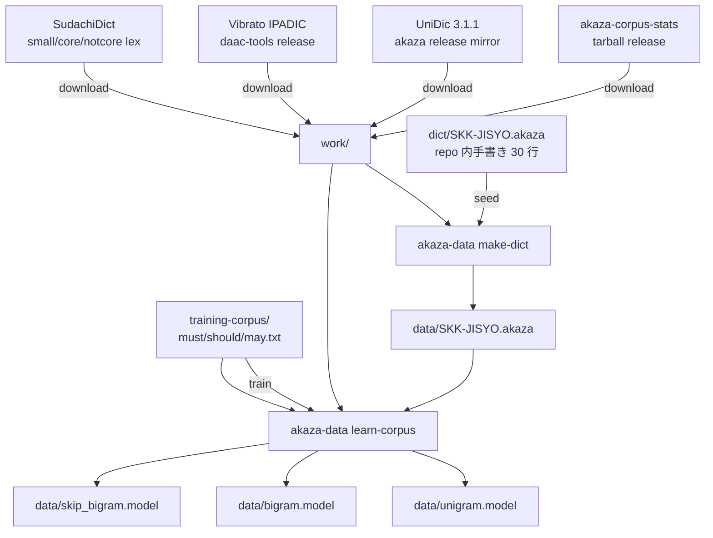

# Phase 2 計画: モデル生成パイプライン調査

**調査日**: 2026-06-03
**目的**: Phase 1.2 で組み込んだ libakaza バックエンドを **実際に動かす** ためのモデル (unigram/bigram/skip_bigram/SKK-JISYO.akaza) をどう作るか、上流の akaza-default-model パイプラインを一次ソースで読み解き、ぬこIME 用の Phase 2 段取りを確定する。

## 1. 上流の生成パイプライン (akaza-default-model)

[`akaza-im/akaza`](https://github.com/akaza-im/akaza) の `default-model/Makefile` ([rev 8a40428](https://github.com/akaza-im/akaza/blob/8a404281ece7ca51119127a96bdde8c153b0df61/default-model/Makefile)) から再構成:



中心ツール: `akaza-data` CLI ([`akaza-im/akaza/akaza-data`](https://github.com/akaza-im/akaza/tree/8a404281ece7ca51119127a96bdde8c153b0df61/akaza-data))。Rust 製、`cargo install --git ...` でインストール可能。

## 2. ライセンス境界の再評価

### 2.1 akaza-corpus-stats (= unigram/bigram の元データ)

[公式 NOTICE](https://github.com/akaza-im/akaza-corpus-stats/blob/main/NOTICE) のデータソース:

| # | データ | ライセンス | 我々の評価 |
|---|---|---|---|
| 1 | Japanese Wikipedia | CC BY-SA 4.0 | ✅ 再配布可 (BY-SA 継承) |
| 2 | 青空文庫 | Public Domain | ✅ |
| 3 | CC-100 Japanese (Common Crawl) | (実質的に研究利用) | ⚠️ 商用配布は要確認 |
| 4 | IPADIC (Vibrato 経由) | BSD-3-Clause | ✅ |

**SKK-JISYO.L (GPL-2.0) は corpus-stats のソースに含まれない。**

### 2.2 akaza-default-model SKK-JISYO.akaza 生成入力

| 入力 | ライセンス | 用途 |
|---|---|---|
| `dict/SKK-JISYO.akaza` (上流リポ内) | 上流リポと同じ (MIT) | seed 辞書 (約 30 エントリ、手書き) |
| `work/unidic/lex_3_1.csv` | UniDic = **BSD-3 / GPL-2.0 dual** | 語彙抽出 |
| `work/vibrato-ipadic.vocab` | BSD-3 | 語彙抽出 |
| SudachiDict small/core/notcore_lex | Apache-2.0 | 固有名詞補完 |
| training-corpus (must/should/may.txt) | 上流リポ MIT | 文脈ヒント |

**ここにも SKK-JISYO.L は **直接** 参照されていない**。
ただし akaza-default-model の NOTICE は SKK-JISYO.L (GPL-2.0) を 1 番目に記載しており、過去のリビジョンで使っていた可能性、または `dict/SKK-JISYO.akaza` のエントリ起源が SKK-JISYO.L である可能性が残る。
**実エントリの中身**: 「鬼滅の刃」「ミンティア」「プライステーカー」など、SKK-JISYO.L の汎用語彙ではなく **akaza メンテナの手書き** に見える (約 30 行)。

### 2.3 結論

- **Path B (libakaza ベース) は GPL を経由せず実現可能** であることが追加調査で裏付けられた。
- UniDic の dual ライセンスは **BSD-3 側を選択** すれば redistribution 可。
- CC-100 (Common Crawl) のみが微妙。商用配布リスクを避けたいなら **CC-100 を抜いた corpus-stats を自前生成** する案が要る (= 案 II 後述)。

## 3. ぬこIME 用 Phase 2 の取りうるレベル

| 案 | 内容 | 工数 | リスク |
|---|---|---|---|
| **I. 上流 corpus-stats をそのまま使う** | 上流の wordcnt trie をダウンロード → UniDic + SudachiDict + 自前 seed dict で SKK-JISYO.akaza 生成 → learn-corpus で model 群生成 | 小〜中 (CI 数時間) | CC-100 経由のリスク。CC BY-SA 表示義務 |
| **II. corpus-stats を自前再生成 (CC-100 抜き)** | Wikipedia + 青空文庫 のみで unigram/bigram trie を再構築 → 以降は案 I と同じ | 大 (数日の CPU) | リスク低減。クリーン |
| **III. 最小モデル** | SudachiDict + 小規模 corpus (青空文庫だけ) で動作確認用最小モデル | 小 | カバレッジ激低だが「とりあえず libakaza が動く」を証明可 |

**推奨: III → I の二段構え**
- まず **案 III** で Phase 2-A (spike-4) として最小モデルを作って libakaza が実機で動くことを確認する
- 動作確認後、**案 I** で本番品質モデルを構築する
- 案 II は CC-100 商用リスクが顕在化した時の保険として温める

## 4. 配布戦略 (B の最終提案)

[セッション前半の B-1](../../README.md) で **別 GitHub repo (`nuko-ime-model`) を推奨** していた。本調査で次の構造を提案する:

```
foresthill/nuko-ime-model
├── README.md              # 概要、ダウンロード手順、ライセンス
├── LICENSE                # Pipeline scripts: MIT/Apache-2.0
├── NOTICE                 # データソース別の継承ライセンス記載
├── Makefile               # 再現性のためのビルドスクリプト
├── scripts/               # 前処理 (Python/シェル)
├── seed/SKK-JISYO.akaza   # 手書き seed 辞書 (ぬこIME 用、MIT)
├── training-corpus/       # must/should/may テキスト (我々の文脈ヒント)
└── (生成物は GitHub Releases に添付)
```

リリース (例: `v0.1.0-min`, `v0.1.0`) 毎にビルドした `unigram.model` / `bigram.model` / `skip_bigram.model` / `SKK-JISYO.akaza` を tarball で添付する。
ぬこIME 側のインストーラ (将来) は最新リリースを HTTP 取得 → `~/Library/Application Support/nuko-ime/akaza-model/` に展開する。

ライセンス継承の表現:
- `nuko-ime-model/LICENSE` — pipeline (Makefile, scripts) は MIT
- `nuko-ime-model/NOTICE` — Wikipedia CC BY-SA 表示、UniDic BSD-3、SudachiDict Apache、IPADIC BSD-3
- 生成 tarball 内に NOTICE を同梱
- ぬこIME 本体は MIT/Apache 維持 (モデルは別配布なので汚染しない)

## 5. Phase 2 サブタスク

| ID | 内容 | 出力 | 工数 |
|---|---|---|---|
| 2-A | spike-4: `akaza-data` CLI を手元でビルド・動作確認 | `docs/spikes/akaza-data-cli-spike.md` | 半日 |
| 2-B | 別 repo `foresthill/nuko-ime-model` 作成 + scaffold (LICENSE / NOTICE / Makefile 骨格 / seed/SKK-JISYO.akaza) | 新リポ初期コミット | 1 日 |
| 2-C | **案 III** で最小モデル生成 (青空文庫 + SudachiDict 小規模) → libakaza ロード成功確認 | `v0.0.1-min` リリース | 1〜2 日 |
| 2-D | ぬこIME 本体: `NUKO_AKAZA_MODEL_DIR` でモデルを指定して実機で変換が走ることを目視確認 | 検証ログ | 半日 |
| 2-E | **案 I** で本番モデル生成 (上流 corpus-stats + UniDic + SudachiDict + seed) | `v0.1.0` リリース | 1〜3 日 (CI 時間込み) |
| 2-F | ぬこIME 本体: モデルダウンローダ実装 (releases から取得して展開) | nuko-cli or nuko-macos に CLI 追加 | 1 日 |

## 6. ユーザー判断が必要な項目

1. **別 repo 名**: `nuko-ime-model` で OK か、別の命名 (例: `nuko-ime-data`) か
2. **CC-100 を許容するか**: 案 I (上流まま) で進めるか、案 II (再生成) を保険として用意するか
3. **seed/SKK-JISYO.akaza の内容**: ぬこIME 用に再構築するか、上流 30 エントリをそのまま流用するか
4. **モデルダウンローダの UX**: 初回起動時に自動 DL するか、ユーザーに手動配置を求めるか

## 7. 次のセッションの出発点

PR (本ドキュメント) マージ後、**Phase 2-A (spike-4)** から着手。
`akaza-data` CLI が macOS で `cargo install` できるか、`akaza-data make-dict` / `akaza-data learn-corpus` の subcommand 表面はどうなっているか、を実機検証して別 spike doc を残す。

## 関連

- [`docs/spikes/libakaza-api-survey.md`](./libakaza-api-survey.md) — libakaza 公開 API
- [`docs/spikes/libakaza-no-model-spike.md`](./libakaza-no-model-spike.md) — モデル不在エラー挙動
- [`docs/spikes/libakaza-send-constraint.md`](./libakaza-send-constraint.md) — Send 制約
- [`docs/ARCHITECTURE.md`](../ARCHITECTURE.md) — Path B 全体方針
- [`docs/ROADMAP.md`](../ROADMAP.md) — Phase 2 の位置づけ
