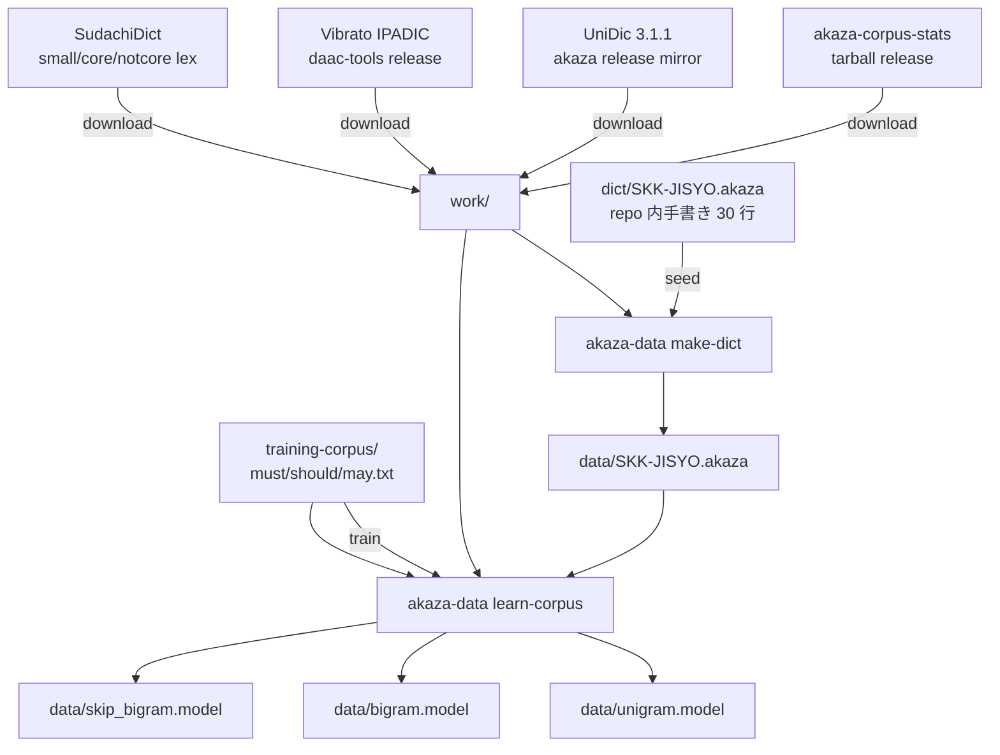

# Phase 2 計画: モデル生成パイプライン調査

**調査日**: 2026-06-03
**目的**: Phase 1.2 で組み込んだ libakaza バックエンドを **実際に動かす** ためのモデル (unigram/bigram/skip_bigram/SKK-JISYO.akaza) をどう作るか、上流の akaza-default-model パイプラインを一次ソースで読み解き、ぬこIME 用の Phase 2 段取りを確定する。

## 1. 上流の生成パイプライン (akaza-default-model)

[`akaza-im/akaza`](https://github.com/akaza-im/akaza) の `default-model/Makefile` ([rev 8a40428](https://github.com/akaza-im/akaza/blob/8a404281ece7ca51119127a96bdde8c153b0df61/default-model/Makefile)) から再構成:



中心ツール: `akaza-data` CLI ([`akaza-im/akaza/akaza-data`](https://github.com/akaza-im/akaza/tree/8a404281ece7ca51119127a96bdde8c153b0df61/akaza-data))。Rust 製、`cargo install --git ...` でインストール可能。

## 2. ライセンス境界の再評価

### 2.1 akaza-corpus-stats (= unigram/bigram の元データ)

[公式 NOTICE](https://github.com/akaza-im/akaza-corpus-stats/blob/main/NOTICE) のデータソース:

| # | データ | ライセンス | 我々の評価 |
|---|---|---|---|
| 1 | Japanese Wikipedia | CC BY-SA 4.0 | ✅ 再配布可 (BY-SA 継承) |
| 2 | 青空文庫 | Public Domain | ✅ |
| 3 | CC-100 Japanese (Common Crawl) | (実質的に研究利用) | ⚠️ 商用配布は要確認 |
| 4 | IPADIC (Vibrato 経由) | BSD-3-Clause | ✅ |

**SKK-JISYO.L (GPL-2.0) は corpus-stats のソースに含まれない。**

### 2.2 akaza-default-model SKK-JISYO.akaza 生成入力

| 入力 | ライセンス | 用途 |
|---|---|---|
| `dict/SKK-JISYO.akaza` (上流リポ内) | 上流リポと同じ (MIT) | seed 辞書 (約 30 エントリ、手書き) |
| `work/unidic/lex_3_1.csv` | UniDic = **BSD-3 / GPL-2.0 dual** | 語彙抽出 |
| `work/vibrato-ipadic.vocab` | BSD-3 | 語彙抽出 |
| SudachiDict small/core/notcore_lex | Apache-2.0 | 固有名詞補完 |
| training-corpus (must/should/may.txt) | 上流リポ MIT | 文脈ヒント |

**ここにも SKK-JISYO.L は **直接** 参照されていない**。
ただし akaza-default-model の NOTICE は SKK-JISYO.L (GPL-2.0) を 1 番目に記載しており、過去のリビジョンで使っていた可能性、または `dict/SKK-JISYO.akaza` のエントリ起源が SKK-JISYO.L である可能性が残る。
**実エントリの中身**: 「鬼滅の刃」「ミンティア」「プライステーカー」など、SKK-JISYO.L の汎用語彙ではなく **akaza メンテナの手書き** に見える (約 30 行)。

### 2.3 結論

- **Path B (libakaza ベース) は GPL を経由せず実現可能** であることが追加調査で裏付けられた。
- UniDic の dual ライセンスは **BSD-3 側を選択** すれば redistribution 可。
- CC-100 (Common Crawl) のみが微妙。商用配布リスクを避けたいなら **CC-100 を抜いた corpus-stats を自前生成** する案が要る (= 案 II 後述)。

## 3. ぬこIME 用 Phase 2 の取りうるレベル

| 案 | 内容 | 開発者 DL | 開発者工数 | エンドユーザー DL | リスク |
|---|---|---|---|---|---|
| **I. 上流 corpus-stats をそのまま使う** | 上流の wordcnt trie tarball を取得 → UniDic + SudachiDict + seed dict で SKK-JISYO.akaza 生成 → learn-corpus で model 群生成 | ~270 MB | 小〜中 (CI 数時間) | ~150 MB | CC-100 経由のリスク (個人 OSS では実用上問題なし) |
| **II. corpus-stats を自前再生成 (CC-100 抜き)** | Wikipedia + 青空文庫 のみで unigram/bigram trie を再構築 → 以降は案 I と同じ | **~60 GB** (CC-100 抜き Wikipedia ダンプ等) | 大 (数日の CPU) | ~150 MB | CC-100 リスクなし |
| **III. 最小モデル (動作確認用)** | SudachiDict + 小規模 corpus (青空文庫だけ等) で動作確認用最小モデル | < 100 MB | 小 | 数 10 MB | カバレッジ激低だが「とりあえず libakaza が動く」を証明可 |

**確定方針 (2026-06-03 ユーザー判断)**: 案 I を本線、 III をスパイク用に使う **二段構え**。
- Phase 2-A〜2-C で **案 III** の最小モデルを試作して libakaza が実機で動くことを最速で確認
- Phase 2-E で **案 I** の本番モデルに置換
- 案 II は CC-100 商用配布リスクが顕在化した時の保険として温める (現状の個人 OSS 範囲では発動しない見込み)

### サイズ感の注記

エンドユーザーが触る ~150 MB は IME として標準的:
- macOS の他 IME (例: ATOK ~1 GB、Mozc ~数百 MB) と同等レンジ
- 開発者が触る ~270 MB (案 I) も `make` 1 回で済むので問題なし
- 案 II の 60 GB は CC-100 等の **生テキスト** ダンプを指すもので、ユーザーには絶対に触らせない

実モデルサイズの根拠: [akaza-default-model releases](https://github.com/akaza-im/akaza-default-model/releases) の `akaza-default-model.tar.gz` が 68〜151 MB (圧縮済)。

## 4. 配布戦略 (確定)

**モノレポで `model-pipeline/` を運用**する (別 repo は作らない)。生成物は GitHub Releases に添付し、リポジトリ自体は軽いまま保つ。

```
nuko-ime/                       # 既存
├── nuko-core/                  # 既存
├── nuko-macos/                 # 既存
├── model-pipeline/             # 新規 (Phase 2-B)
│   ├── README.md               # ビルド手順
│   ├── NOTICE                  # データソース別ライセンス継承
│   ├── Makefile                # 再現性のためのビルドスクリプト
│   ├── scripts/                # 前処理 (Python/シェル)
│   ├── seed/SKK-JISYO.akaza    # 手書き seed 辞書 (最初は上流流用、Phase 2-E で自前置換)
│   ├── training-corpus/        # must/should/may テキスト
│   └── .gitignore              # work/ data/ 等の中間/生成物を除外
└── docs/                       # 既存
```

### CI / リリース運用

- 既存 CI とは別の workflow (`.github/workflows/model-build.yml`) で `model-pipeline/Makefile` を呼ぶ
- 手動 dispatch + tag push 起動 (頻度低い、毎 PR では走らせない)
- リリース命名: `model-v0.1.0` / `model-v0.1.1-min` 等で `app-v0.1.0` とは分離
- 生成 tarball には NOTICE を必ず同梱

### ライセンス境界

- ぬこIME 本体 (`nuko-core/` 等): MIT / Apache-2.0 dual 維持
- `model-pipeline/` の scripts / seed: MIT
- 生成モデル tarball: CC BY-SA 4.0 (Wikipedia 由来の継承) + UniDic BSD-3 + SudachiDict Apache の合成。NOTICE で明示
- → モデルは「データ」なのでコード側ライセンスを汚染しない (慣例的に独立扱い)

## 5. Phase 2 サブタスク

| ID | 内容 | 出力 | 工数 |
|---|---|---|---|
| 2-A | spike-4: `akaza-data` CLI を手元でビルド・動作確認 | `docs/spikes/akaza-data-cli-spike.md` | 半日 |
| 2-B | モノレポ内 `model-pipeline/` scaffold (NOTICE / Makefile 骨格 / seed は上流 30 エントリ流用 / `.github/workflows/model-build.yml`) | 初期コミット | 1 日 |
| 2-C | **案 III** で最小モデル生成 (青空文庫 + SudachiDict 小規模) → libakaza ロード成功確認 | 中間検証ログ (リリースまではしない) | 1〜2 日 |
| 2-D | ぬこIME 本体: `NUKO_AKAZA_MODEL_DIR` でモデル指定 → 実機で変換が走ることを目視確認 | 検証ログ | 半日 |
| 2-E | **案 I** で本番モデル生成 (上流 corpus-stats + UniDic + SudachiDict + 自前 seed に置換) → `model-v0.1.0` リリース | リリース tarball ~150 MB | 1〜3 日 (CI 時間込み) |
| 2-F | ぬこIME 本体: **まず手動配置のドキュメント化** (`~/Library/Application Support/nuko-ime/akaza-model/` へユーザーが展開する手順を README に記載) | README 更新 | 半日 |
| 2-G | (将来) モデル自動ダウンローダ実装 (releases から取得して展開) | nuko-cli or nuko-macos に CLI 追加 | 1 日 |

順序ルール: 2-A → 2-B → 2-C → 2-D まで進めば「libakaza が実機で動く」が達成される (Phase 2 の minimum viable goal)。
そこから 2-E (品質向上) と 2-F (ユーザー配布) は並行で進められる。

## 6. ユーザー判断 (2026-06-03 確定)

| # | 項目 | 確定方針 |
|---|---|---|
| 1 | repo 構造 | **モノレポ `model-pipeline/`** (別 repo は作らない) |
| 2 | CC-100 を許容するか | **許容** (個人 OSS のため案 I で進める。案 II は商用化リスク顕在化時の保険として温存) |
| 3 | seed/SKK-JISYO.akaza | **上流 30 エントリ流用 (Phase 2-B〜2-D) → 自前置換 (Phase 2-E)** の二段階 |
| 4 | モデルダウンローダ UX | **手動配置を先 (2-F)、自動 DL は後 (2-G)**。ライセンスとは無関係、UX 工数の問題 |

## 7. 次のセッションの出発点

本 PR マージ後、**Phase 2-A (spike-4)** から着手。
`akaza-data` CLI が macOS で `cargo install` できるか、`akaza-data make-dict` / `akaza-data learn-corpus` の subcommand 表面はどうなっているか、を実機検証して別 spike doc を残す。

## 関連

- [`docs/spikes/libakaza-api-survey.md`](./libakaza-api-survey.md) — libakaza 公開 API
- [`docs/spikes/libakaza-no-model-spike.md`](./libakaza-no-model-spike.md) — モデル不在エラー挙動
- [`docs/spikes/libakaza-send-constraint.md`](./libakaza-send-constraint.md) — Send 制約
- [`docs/ARCHITECTURE.md`](../ARCHITECTURE.md) — Path B 全体方針
- [`docs/ROADMAP.md`](../ROADMAP.md) — Phase 2 の位置づけ
